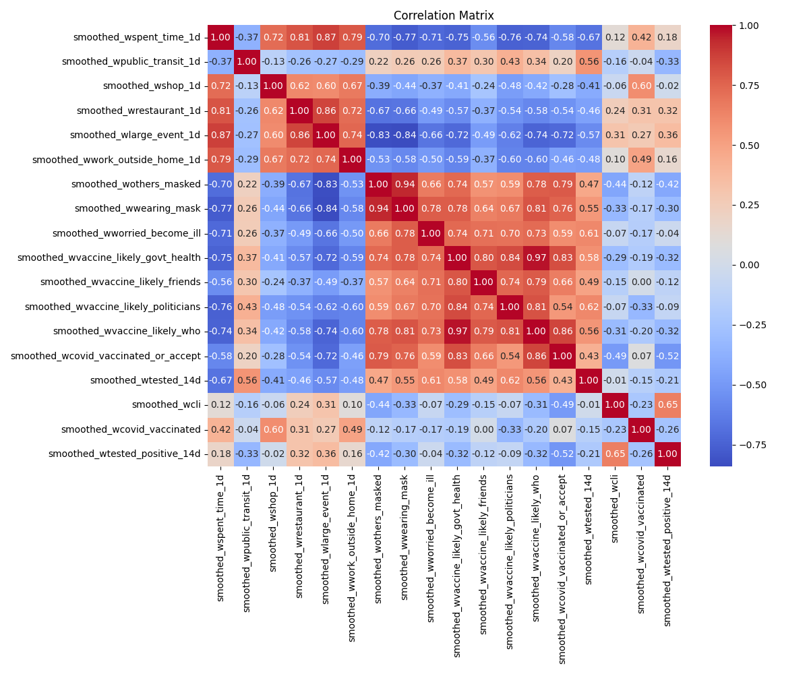
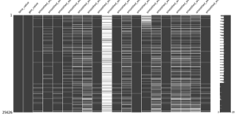
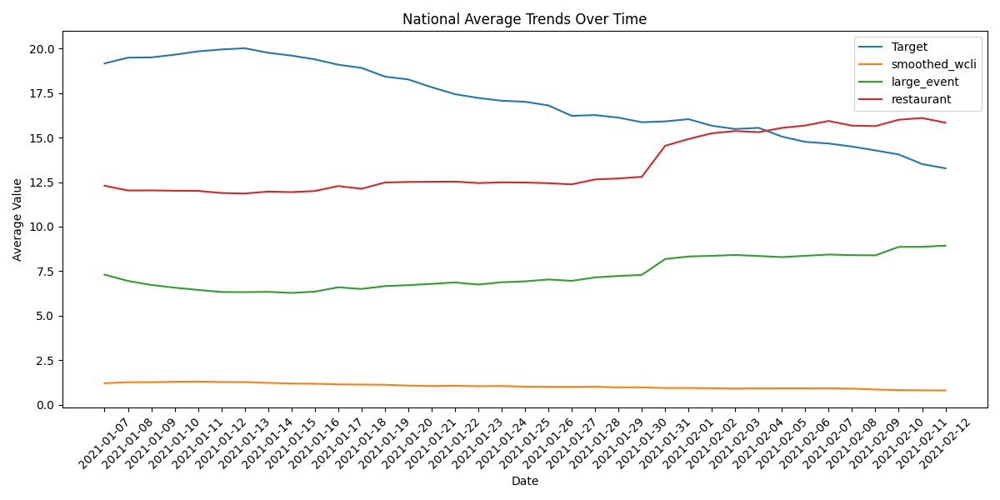
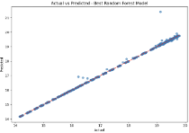
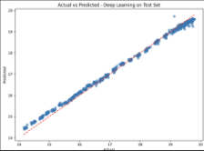
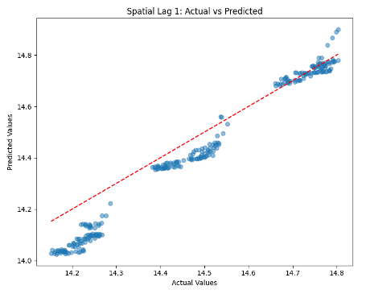
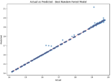
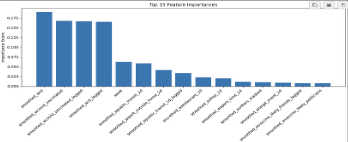

# covid-positivity-prediction
 

This project explores spatial and temporal modeling techniques to predict county-level COVID-19 test positivity rates in the United States. We compare the performance of multiple models, including Ridge Regression, Spatial Lag 1 Regression, Multi-Layer Perceptron (MLP), and Random Forest, using survey-based behavioral and health data.

---

## Project Goals

- Predict county-level **COVID-19 positivity rates**
- Evaluate effectiveness of different models in capturing **spatio-temporal dynamics**
- Provide insights for **public health policy** and early intervention

---
## Problem & Findings

**Problem**

COVID-19 positivity rates vary across both time and geography, driven by behavioral and structural factors. Traditional forecasting models often overlook spatial dependencies, limiting their usefulness for regional public health planning. This project tackles the challenge of predicting county-level positivity rates by integrating temporal trends and spatial spillover effects into the modeling process.

**Findings**

Incorporating spatial-temporal features significantly improved predictive performance:
- STAR(2) (Spatio-Temporal Autoregressive model with two lags) outperformed baseline models in both R² and RMSE.
- Behavioral signals—such as mask usage, public activity, and mobility—were highly predictive of case surges.
-	Random Forest with moving average imputation achieved R² = 0.998, outperforming MLP and spatial lag regression.
- Key features included lagged vaccination rates, COVID-like illness (CLI) indicators, and mobility trends.
- Notably, tree-based models performed well without requiring explicit spatial lags, suggesting they can implicitly capture regional transmission dynamics.

These findings demonstrate that combining behavioral insights with spatio-temporal modeling can yield interpretable and highly accurate forecasts, offering actionable tools for pandemic response planning.

---

## Dataset

- **Source**: COVID-19 Trends and Impact Survey (CTIS) by Carnegie Mellon University and Facebook
- **Time Period**: January 7 – February 12, 2021
- **Scope**: 25,626 county-level daily records from across the U.S.
- **Features**: 19 variables covering health behaviors, beliefs, and outcomes

---

## Exploratory Data Analysis

I examined feature correlations, missing data, and time trends before modeling.





---

## Models Compared

| Model                      | Highlights                                        |
|---------------------------|---------------------------------------------------|
| Ridge Regression          | Linear baseline with regularization               |
| Spatial Lag 1 Regression  | Captures spatial correlation within states        |
| Multi-Layer Perceptron    | Deep learning model for nonlinear relationships   |
| Random Forest             | Tree-based ensemble model with strong performance |

---

## Performance Summary

**Best Performing Model:**  
- **Random Forest** (with moving average imputation)  
  - R²: 0.998  
  - RMSE: 0.09  
  - MAE: 0.02  
  - Strengths: Nonlinear modeling, high accuracy, robust to noise




**Runner-Up:**  
- **STAR(2)** (Spatio-Temporal Autoregressive model with two lags)
  - R² = 0.999
  - More interpretable, but assumes linearity

---

## Model Comparison (Actual vs Predicted)

| MLP | Spatial Lag | Random Forest |
|-----|-------------|----------------|
|  |  |  |


---

## Key Techniques

- **Spatial Modeling**: Used a row-normalized spatial weights matrix (same-state adjacency)
- **Feature Engineering**: Lag features, rolling averages, behavioral interaction terms
- **Imputation**: Compared moving average vs. KNN imputation
- **Evaluation**: 5-fold CV, RMSE, MAE, and R²

---

## Feature Importance

The Random Forest model reveals which features most influence prediction outcomes.



---

## Policy Implications

- **Vaccination momentum** and **public activity** were strong predictors of both vaccine uptake and COVID spread.
- **Spatial spillovers** matter: counties influence each other across borders.
- Suggests **coordinated regional policies** and monitoring **lagged behavioral indicators**.

---

## Future Work

- Integrate real-time data streams
- Use **LSTM** or **Transformer** architectures for dynamic sequence modeling
- Expand spatial granularity and refine adjacency definitions

---

## File Structure
```
covid-positivity-prediction/
│
├── data/ # CSVs used in the analysis
├── notebooks/ # Jupyter notebooks per model
├── results/ # Charts, metrics, and outputs
├── README.md # Project documentation
├── requirements.txt # Python dependencies
└── .gitignore # Ignore data checkpoints, logs, etc.
```

---

## Citation

COVID-19 Trends and Impact Survey (CTIS), Carnegie Mellon University and Facebook, 2021  

---

## Built With

- Python, Pandas, NumPy
- scikit-learn, PyTorch
- statsmodels, linearmodels

